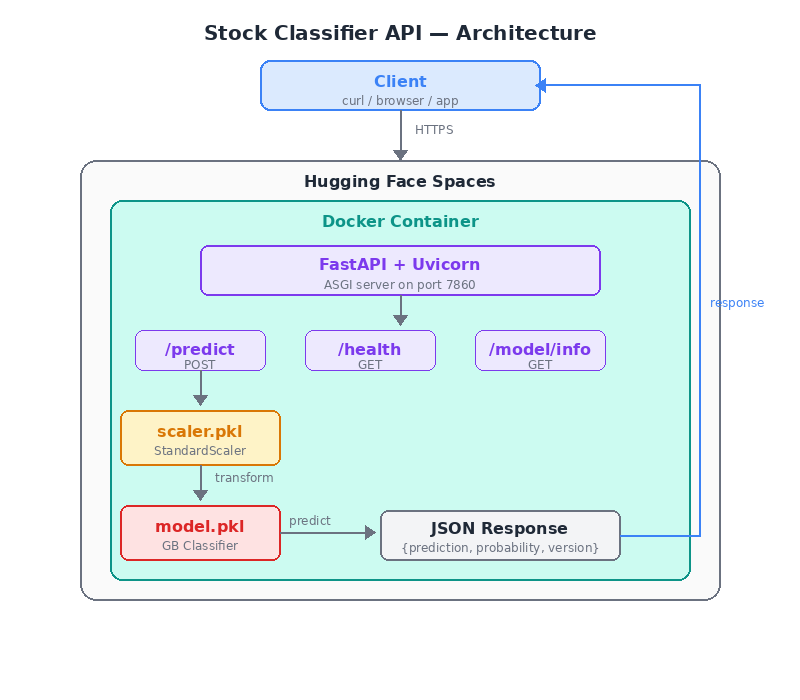

# Stock Classifier API

A production-grade ML API that predicts stock movement direction (up/down) using a Gradient Boosting classifier. Trained from scratch, served via FastAPI, containerized with Docker, and deployed to Hugging Face Spaces.

**Live API:** [https://pugalmugilan-stock-classifier.hf.space](https://pugalmugilan-stock-classifier.hf.space)

---

## Problem Statement

Given a set of stock market features (open, high, low, close, volume), predict whether the stock will move **up (1)** or **down (0)**. This is a binary classification problem solved with a Gradient Boosting ensemble trained on cleaned data (outliers removed via Isolation Forest).

## Why Gradient Boosting?

| Model | Test Accuracy | Notes |
|-------|--------------|-------|
| Logistic Regression | 0.910 | Interpretable but linear |
| Decision Tree | ~0.68 | Overfits, unstable |
| Random Forest | ~0.74 | Better, but GB edges it out |
| **Gradient Boosting (cleaned)** | **0.910** | **Sequential error correction + cleaned data** |
| GB (PCA-reduced) | 0.810 | PCA hurts — features are independent |

Gradient Boosting (on Isolation Forest-cleaned data) was selected for deployment: highest accuracy, represents the full 5-stage ML pipeline built across Weeks 5–6.

## Architecture



**Request flow:** Raw feature values → Pydantic validation → StandardScaler transform (using training-set statistics) → Gradient Boosting predict → JSON response with prediction + probability.

## Endpoints

| Endpoint | Method | Description |
|----------|--------|-------------|
| `/predict` | POST | Takes 5 features, returns prediction + probability |
| `/health` | GET | Returns `{"status": "ok"}` — used by orchestrators |
| `/model/info` | GET | Model metadata: version, features, training info |
| `/docs` | GET | Auto-generated Swagger UI |

## Quick Start

### Try it now (no setup needed)

```bash
curl -X POST https://pugalmugilan-stock-classifier.hf.space/predict \
  -H "Content-Type: application/json" \
  -d '{"feature_1": 50.0, "feature_2": 55.0, "feature_3": 48.0, "feature_4": 53.0, "feature_5": 1000000}'
```

**Response:**
```json
{"prediction": 1, "probability": 0.9296, "version": "v1.0"}
```

### Run locally (venv + uvicorn)

```bash
git clone https://huggingface.co/spaces/pugalmugilan/stock-classifier
cd stock-classifier
python -m venv .venv
source .venv/bin/activate
pip install -r requirements.txt
uvicorn main:app --host 0.0.0.0 --port 7860
# Visit http://localhost:7860/docs
```

### Run with Docker

```bash
git clone https://huggingface.co/spaces/pugalmugilan/stock-classifier
cd stock-classifier
docker build -t stock-classifier:v1 .
docker run -p 7860:7860 stock-classifier:v1
# Visit http://localhost:7860/docs
```

## Performance

| Metric | Value |
|--------|-------|
| Test accuracy | 0.910 |
| Model size | 138 KB |
| Scaler size | 719 bytes |
| Docker image | ~250 MB (python:3.11-slim base) |

## Tech Stack

- **Model:** scikit-learn Gradient Boosting Classifier (100 trees, max_depth=3)
- **Preprocessing:** StandardScaler (fit on training data only)
- **API:** FastAPI + Pydantic input validation
- **Server:** Uvicorn (ASGI)
- **Container:** Docker (python:3.11-slim)
- **Deployment:** Hugging Face Spaces (Docker SDK)
- **Serialization:** joblib

## Project Structure

```
├── main.py              # FastAPI app with /predict, /health, /model/info
├── model.pkl            # Gradient Boosting classifier (138 KB)
├── scaler.pkl           # StandardScaler (719 B)
├── requirements.txt     # Pinned dependencies (scikit-learn==1.7.2)
├── Dockerfile           # 8-line containerization recipe
└── README.md            # This file
```

