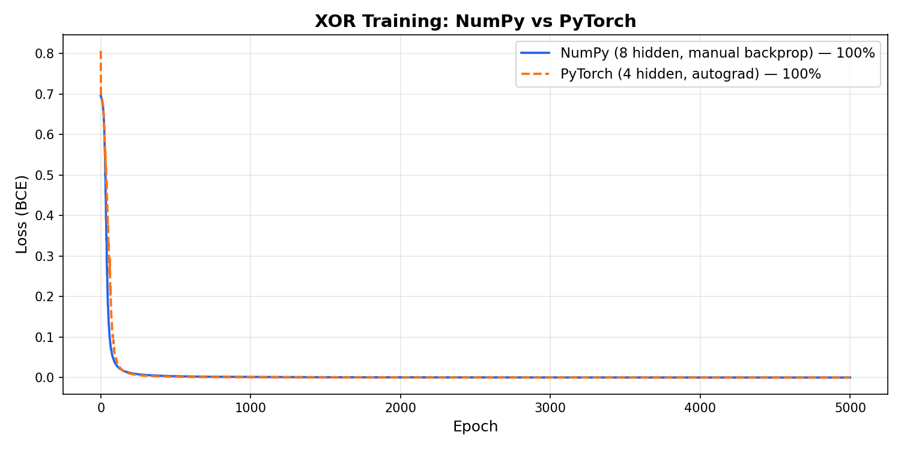

# Neural Network from Scratch — NumPy vs PyTorch

I built a 2-layer neural network twice — once in NumPy with manually-derived backprop, once in PyTorch — to understand exactly what frameworks automate and what stays your responsibility.

## The Problem: XOR

XOR is the simplest problem that **no linear model can solve**. Four points, two classes, no straight line separates them. Logistic regression gets 50% — coin flip. A neural network with one hidden layer solves it perfectly.

## Architecture

```
Input (2)          Hidden (ReLU)         Output (Sigmoid)
┌──────┐          ┌──────────┐           ┌──────────┐
│ x₁   │──────┐   │ neuron 1 │──────┐    │          │
│      │──┐   ├──▶│ neuron 2 │──┐   ├───▶│ ŷ (0–1)  │
│ x₂   │──┤   │   │ neuron 3 │──┤   │    │          │
│      │──┼───┘   │ neuron 4 │──┼───┘    └──────────┘
└──────┘  │       │  ...     │  │
          └──────▶│          │──┘
                  └──────────┘

Shapes:
  W1: (2, hidden)    b1: (hidden,)
  W2: (hidden, 1)    b2: (1,)
```

- **NumPy version:** 8 hidden neurons (needed more to survive dead ReLUs with `random * 0.1` init)
- **PyTorch version:** 4 hidden neurons (Kaiming initialization keeps neurons alive)

## The Training Step — Side by Side

This is the whole point of the project. Same math, different bookkeeping.

### NumPy (17 lines per iteration)
```python
# Forward (4 lines)
Z1 = X @ W1 + b1
A1 = np.maximum(0, Z1)
Z2 = A1 @ W2 + b2
A2 = 1 / (1 + np.exp(-Z2))

# Loss (2 lines)
A2c = np.clip(A2, 1e-8, 1 - 1e-8)
loss = -np.mean(Y * np.log(A2c) + (1 - Y) * np.log(1 - A2c))

# Backward (7 lines)
dZ2 = A2 - Y
dW2 = (1/m) * A1.T @ dZ2
db2 = (1/m) * np.sum(dZ2, axis=0, keepdims=True)
dA1 = dZ2 @ W2.T
dZ1 = dA1 * (Z1 > 0)
dW1 = (1/m) * X.T @ dZ1
db1 = (1/m) * np.sum(dZ1, axis=0, keepdims=True)

# Update (4 lines)
W1 -= lr * dW1; b1 -= lr * db1
W2 -= lr * dW2; b2 -= lr * db2
```

### PyTorch (5 lines per iteration)
```python
predictions = model(X)           # forward pass
loss = loss_fn(predictions, y)   # compute loss
optimizer.zero_grad()            # reset gradients
loss.backward()                  # backward pass (replaces 7 lines)
optimizer.step()                 # update weights (replaces 4 lines)
```

## Loss Curves

Both converge to ~100% accuracy on XOR. Same curve shape — steep drop in the first few hundred epochs, then flat.



## What PyTorch Automated

- **Gradient computation** — `loss.backward()` replaces 7 lines of manually-derived chain rule math (autograd walks the computation graph)
- **Weight updates** — `optimizer.step()` replaces 4 lines of `W -= lr * dW` for each parameter
- **Weight initialization** — `nn.Linear` uses Kaiming init by default, which kept 4 neurons alive where `random * 0.1` needed 8

## What Didn't Change

- **Forward pass logic** — still `W·x + b + activation`, stacked
- **Loss function choice** — still Binary Cross-Entropy, still your decision
- **The hyperparameters that matter** — learning rate, hidden size, number of epochs are still your job to pick
- **The training loop itself** — unlike sklearn's `model.fit()`, PyTorch makes you write the loop (and that's a feature, not a bug — you control every iteration)

## Files

| File | What it does |
|------|-------------|
| `numpy_nn.py` | Full 2-layer NN with hand-coded forward + backward pass |
| `pytorch_nn.py` | Same architecture in PyTorch with autograd |
| `compare.py` | Runs both, prints accuracies, saves side-by-side loss plot |
| `loss_comparison.png` | The two loss curves on one chart |

## How to Run

```bash
# Run individually
python numpy_nn.py
python pytorch_nn.py

# Run comparison (generates loss_comparison.png)
python compare.py
```

## Key Insight

> PyTorch didn't change the math. It automated the bookkeeping.
> Every line of backprop I wrote by hand, autograd does in the background.
> The reason I wrote it manually first is so I'd never confuse
> "I called .backward()" with "magic happened."